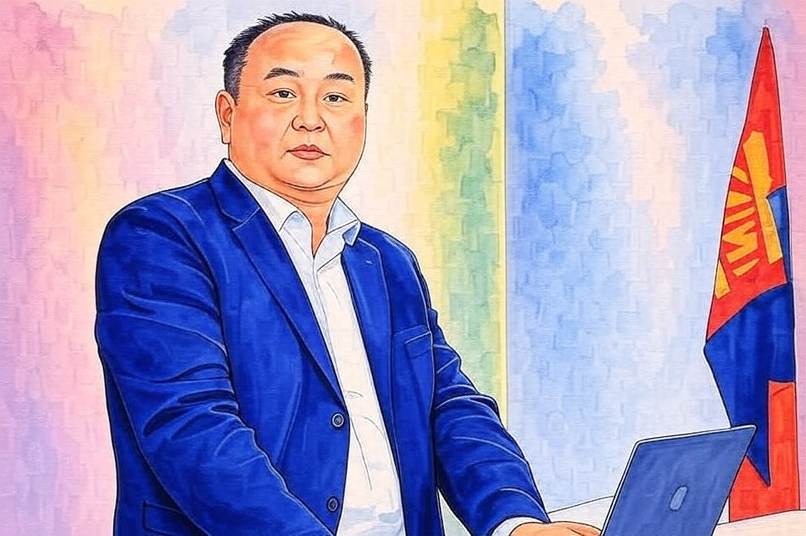

Монгол Улс дахь нийгэм, эдийн засаг, улс төр, засаглалтай холбоотой асуудлаар мэдээлэл цуглуулж, шинжилгээ хийж, саналаа олон нийттэй хуваалцах зорилгыг тээн энэхүү бичил архивыг нээв. Энд аливаа асуудлаар хувийн байр сууриа илэрхийлэх бөгөөд миний ажиллаж ирсэн байгууллагуудын бодлого, үйл ажиллагаатай холбоотой байх албагүй.  

{.image-owner}

Өөрийн тухай товч танилцуулахад эдийн засагч мэргэжилтэй, эдийн засгийн бодлого, төсөв, санхүү, уул уурхай, эрчим хүч зэрэг асуудлаар төрийн бус болон олон улсын байгууллагуудад ажиллаж ирсэн туршлагатай. Мерси Кор, Нээлттэй Нийгэм Форум, Олборлох үйлдвэрлэлийн ил тод байдлын санаачилга, Төлснөө нийтэл эвсэл, Байгалийн баялгийн засаглалын хүрээлэн, Авлигатай тэмцэх газар, Бритиш Колумбын их сургууль зэрэг байгууллагуудтай холбогдон ажиллаж, ШУТИС, Эссексийн Их Сургууль, Төв Европын Их Сургууль, Гаагийн Нийгэм судлалын хүрээлэн, Дюкийн их сургууль, Гриффитын их сургууль зэрэгт суралцаж, мэргэжил дээшлүүлсэн намтартай. Нотолгоонд суурилсан бодлогын шинжилгээ, өгөгдлийн шинжилгээ, ил тод байдал, уул уурхайн бодлого, төсвийн бодлого, эрчим хүчний шилжилт, авлигатай тэмцэх зэрэг асуудлыг түлхүү сонирхож ирсэн.

