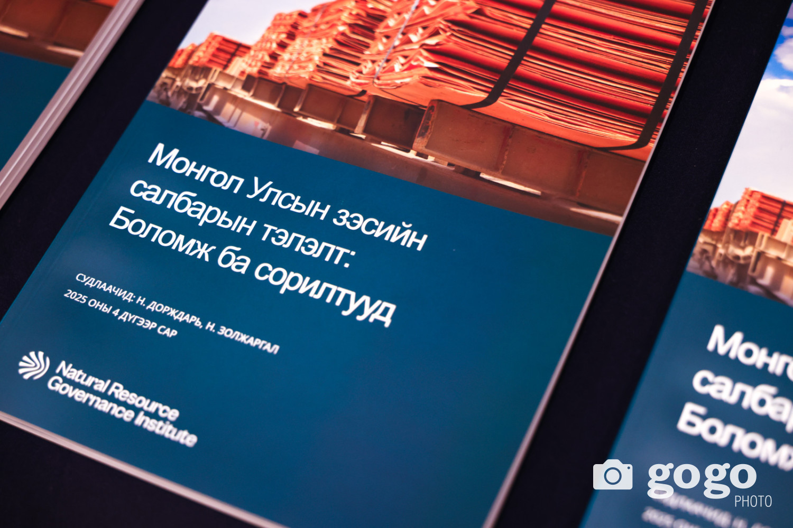

{#image-report_cu}

Монгол Улсын зэсийн салбарыг тэлэх боломжийн талаар хийсэн судалгааны талаар танилцуулга хийв. gogo.mn вэбсайт энэ талаар сурвалжилснаас эш татвал:

"Эдийн засагч, судлаач Н.Дорждарь “Монгол Улсын зэсийн салбарын тэлэлт: Боломж ба сорилтууд” судалгааны үр дүнг өнөөдөр танилцуулав. Тэрээр Байгалийн баялгийн засаглалын хүрээлэнгийн Монгол дахь менежерээр ажилладаг.  

“Монгол Улсын зэсийн салбарын тэлэлт” судалгааг Европын уур амьсгалын сангийн нэг санаачилга болох Олон улсын эрчим хүчний нэгдсэн сангийн дэмжлэгээр хийжээ.  

Судлаач Н.Дорждарь:
-Боловсруулах үйлдвэр барина, нэмүү өртөг бүтээнэ, ажлын байр нэмэгдүүлнэ гэж улс төрчид их ярьдаг. Олон нийт ч үүнийг дэмжин, талархан хүлээн авдаг. Гэхдээ эдийн засагчийн хувьд хэлэхэд мега төслүүдийн ТЭЗҮ-ийг эрх баригчид ил тод танилцуулдаггүй. Тэндээс хэдхэн тоог шүүрч аваад  мэдээлдэг. ТЭЗҮ-ийг эдийн засагчид, судлаачид, хэвлэлийнхэн, иргэний нийгмийн байгууллага, иргэдэд бүрэн танилцуулдаггүй. Олон нийтийн дунд маргаан, мэтгэлцээн өрнүүлэхгүй байна.

Төрийн албан хаагчид тодорхой мэдээлэлтэй боловч дарга нар нь зөвшөөрдөггүй тул тэр мэдээллээ  төдийлөн хуваалцдаггүй. Гэтэл олон нийтийн дэмжлэггүйгээр ямар ч том төсөл амжилттай хэрэгжихгүй гэдгийг бид өнгөрсөн хугацаанд харлаа. Ганц Монголд ч биш, бусад улсуудад ч байдал адилхан.  

Иргэд ойлгохгүй, мэдэхгүй, асуудлыг улс төржүүлдэг гэж шүүмжлээд, цааш түлхэн, тэднийг бүрэн мэдээллээр хангахгүй байвал уул уурхайн төслүүдийг олон нийт дэмжихгүй. Өнгөрсөн арванхоёрдугаар сард Францын Орано  групптэй ураны баяжмалын гэрээ байгуулахаас өмнө олон нийтэд хангалттай их мэдээллийг олон сувгаар өглөө. Энэ сайн жишиг болсон. Цаашид уул уурхайн бүх төслийг хэрэгжүүлэхээс өмнө мэдээлэл харилцаанд ихээхэн анхаарах шаардлагатай." 

gogo.mn мэдээллийн сайтын Б.Эрдэнэчимэг ийнхүү бичсэн байна. Дэлгэрүүлж [эндээс](https://gogo.mn/r/j6n9v) үзэх боломжтой.