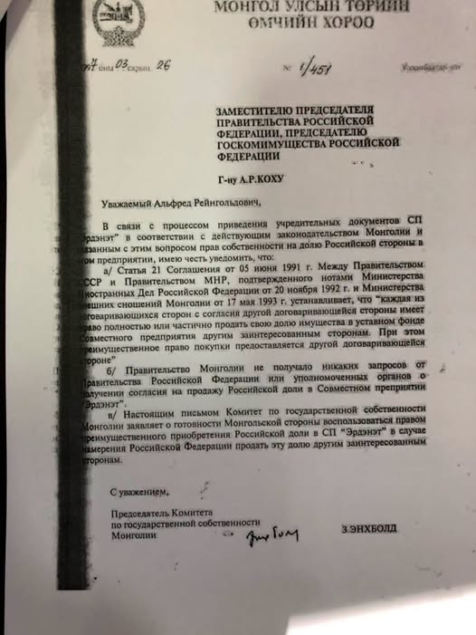

Эрдэнэт хотын 50 жилийн ойг энэ өдрүүдэд тэмдэглэж байна. УИХ-ын дарга асан З.Энхболд өөрийн нүүр хуудсандаа дараах зүйлийг бичжээ.

"Өчигдрөөс эхлэн 50 жилийн ойг нь тэмдэглэж байгаа Эрдэнэт хотын түүх Эрдэнэт үйлдвэрээс эхлэлтэй. Тэр үед үйлдвэр байгуулахын тулд эхлээд хот байгуулдаг байж" гэж эхлээд

"Эрдэнэт үйлдвэрийг 1973 онд байгуулагдсан гэж үзвэл өнөөдрийг хүртэл 53 жил болоход Орос болон Монгол талд уг үйлдвэрийг хувьчлах талаар 2 удаа хууль зөрчсөн үйлдэл гарч 2-ууланд нь миний оролцоотойгоор хүчингүй болж байжээ" гэсэн байв.

