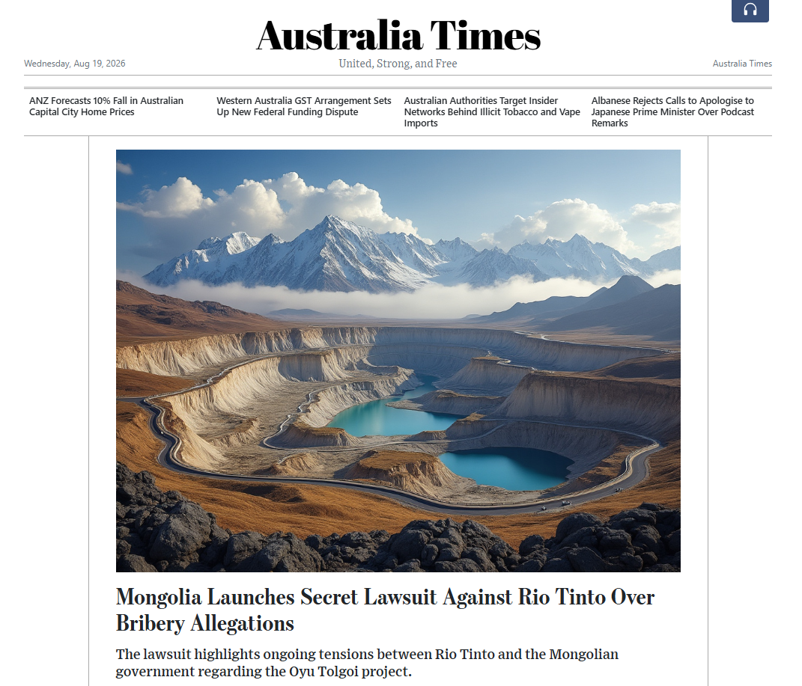
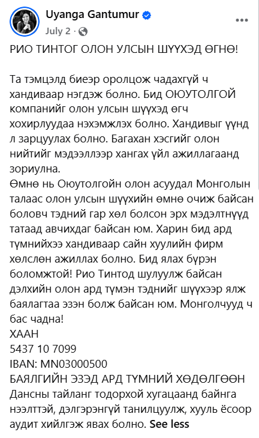

Монголын Засгийн газар Rio Tinto болон түүний охин компаниудыг Оюу Толгойн төсөлтэй холбоотой улс төрийн авлига, хээл хахуулийн схемд оролцсон байж болзошгүй гэж буруутгасан нууц шүүхийн ажиллагаа Их Британид эхлүүлсэн тухай Australian Financial Review мэдээлсэн. Ижил төстэй мэдээлэл бусад хэвлэлээр ч гарч байх шиг.

Энэ асуудлыг харин олон нийт нэг их анхаарахгүй байх шиг. Бензингүй болсон иргэд ОТ-г анхаарах сөхөөгүй байгаа. Үнэхээр ЗГ нэхэмжлэх гаргасан уу? Эсхүл О.Батнайрамдал, Б.Солонгоо, Э.Баясгалан нарын зүгээс бодит алхмууд хийж эхэлсэн үү? Эсхүл Г.Уянга гишүүн асан амалсандаа хүрч байна уу?

