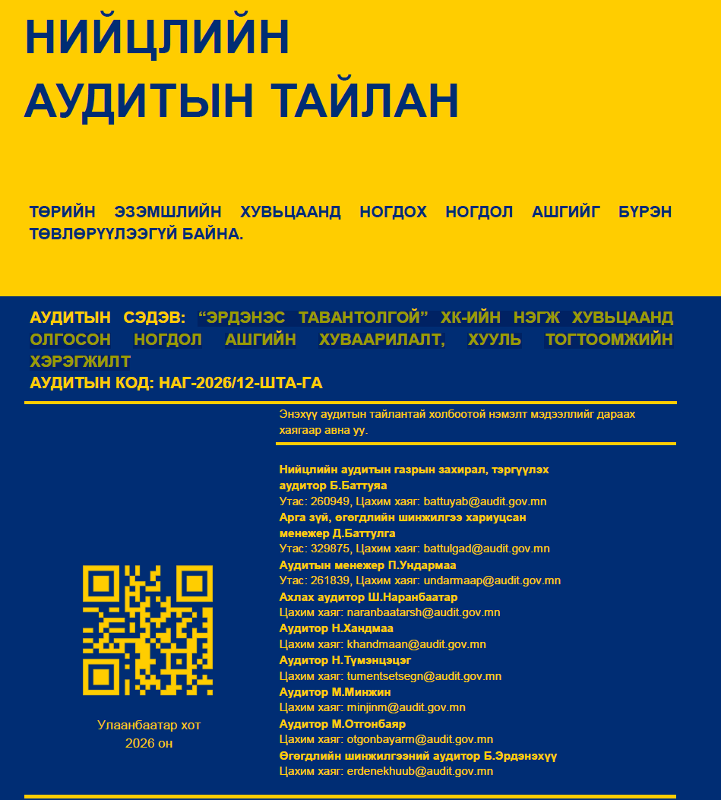
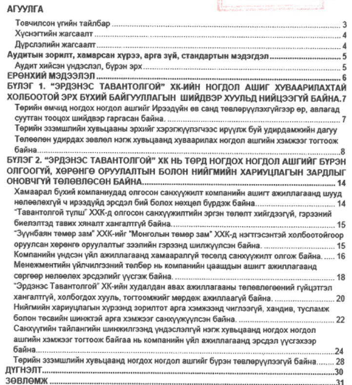

Төрийн өмчит компаниудыг тойрсон улс төр, эрх ашиг, хэрэг төвөг, дуулиан шуугиан тоогоо алдсан. Эрдэнэс Таван Толгойд саяхан нийцлийн аудит хийсэн юм байна. Гарчиг нь "Эрдэнэс Тавантолгой ХК-Ийн Нэгж Хувьцаанд Олгосон Ногдол Ашгийн Хуваарилалт, Хууль Тогтоомжийн Хэрэгжилт". Гарчгийг нь хараад л цагаандаа гарч гэж бодлогдох. 

Төрийн өмчит компаниуд ногдол ашгийн бодлого үгүй, улмаар ашигтай ажиллах үед тэр бялууг хуваах эрхийг авах сонирхолтой улс төрийн хүчнүүд олон. Улс орон, компанийн удирдлагууд нь нэгийг ярьж, нөгөөг хийнэ. Ил байна гэдэг, улс төрийн хэрүүл дундаас бага сага мэдээлэл ил болно. Ил байсан ч хэнд ч хариуцлага тооцохгүй юм чинь "намайг хэн хэлэхэв" гэх хандлагатай. Хулгай томорч, арга нарийсна. 
